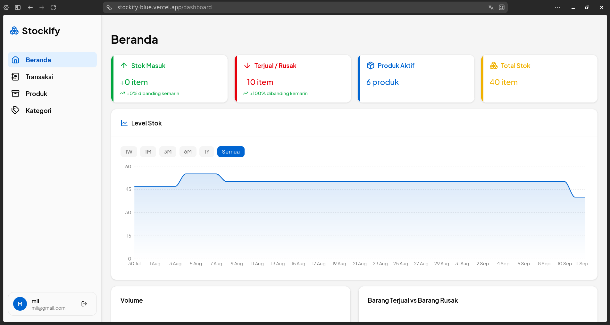

# Stockify

Aplikasi manajemen stok barang untuk UMKM — mencatat pergerakan stok (masuk/keluar), mengelola kategori produk, dan memberikan insight (dashboard, laporan, prediksi kehabisan stok) berdasarkan riwayat transaksi.



## ✨ Fitur

- 🔐 Autentikasi user (sign up, sign in, JWT-based)
- 📦 CRUD produk & kategori, dengan soft-delete (archive/reactivate)
- 📊 Pencatatan stock movement (restock, sold, refund, broken) dengan validasi stok tidak boleh minus
- 📈 Dashboard: ringkasan stok, top movers, produk low-stock
- 📉 Grafik performa per produk & prediksi estimasi kehabisan stok
- 🏢 Multi-tenant — data tiap user terisolasi

## 🛠️ Tech Stack

**Backend**
- Go, [Gin](https://gin-gonic.com/) — HTTP framework
- GORM + PostgreSQL
- JWT (`golang-jwt/jwt`) untuk autentikasi
- Google Cloud Storage — penyimpanan gambar produk
- Swagger (`swaggo`) — dokumentasi API

**Frontend**
- Next.js, TypeScript
- Tailwind CSS, shadcn/ui
- Axios, Tanstack Query 

**Arsitektur:** Clean Architecture + Domain-Driven Design (DDD)

## 📁 Struktur Repo

```
stockify/
├── backend/
│   ├── cmd/api/              # entry point
│   └── internal/
│       ├── domain/           # entity, value object, repository interface, domain service
│       ├── application/      # use cases (command & query — CQRS-lite)
│       ├── infrastructure/   # implementasi repository (GORM), storage, DB
│       └── http/             # handler, middleware, routing
├── frontend/
│   └── src/
│       ├── app/               # routing (Next.js App Router)
│       ├── features/          # 1 folder per fitur (dashboard, product, category, dll)
│       └── shared/             # komponen, hooks, lib yang dipakai lintas fitur
└── docs/                     # FR, domain model, ADR
```

## 🚀 Getting Started

### Prasyarat
- Go 1.22+
- Node.js 18+
- PostgreSQL

### Backend

```bash
cd backend
cp .env.example .env    # isi DATABASE_URL, JWT_SECRET, dll
go mod download
go run cmd/api/main.go
```

Migration jalan otomatis saat aplikasi start. 

API docs (Swagger) bisa diakses di `http://localhost:<port>/swagger/index.html` setelah server jalan.

### Frontend

```bash
cd frontend
cp .env.example .env.local   # isi NEXT_PUBLIC_API_URL
npm install
npm run dev
```

Buka `http://localhost:3000`.

### Environment Variables

**Backend (`.env`)**
| Variable | Deskripsi |
|---|---|
| `DATABASE_URL` | Connection string PostgreSQL |
| `JWT_SECRET` | Secret buat signing JWT |
| `FRONTEND_URL` | URL frontend (buat CORS) |
| `GCS_BUCKET_NAME` | Nama bucket Google Cloud Storage |
| `GCS_PROJECT_ID` | Id project Google Cloud Storage |
| `PORT` | Nomor port untuk menjalankan project |

**Frontend (`.env.local`)**
| Variable | Deskripsi |
|---|---|
| `NEXT_PUBLIC_API_URL` | Base URL backend API |
