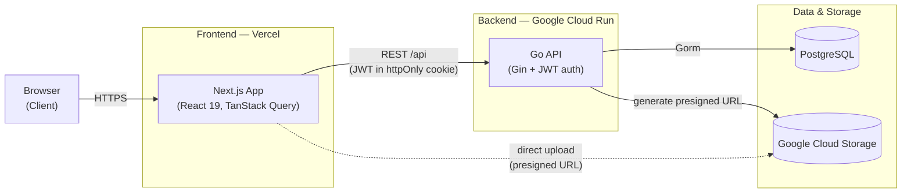
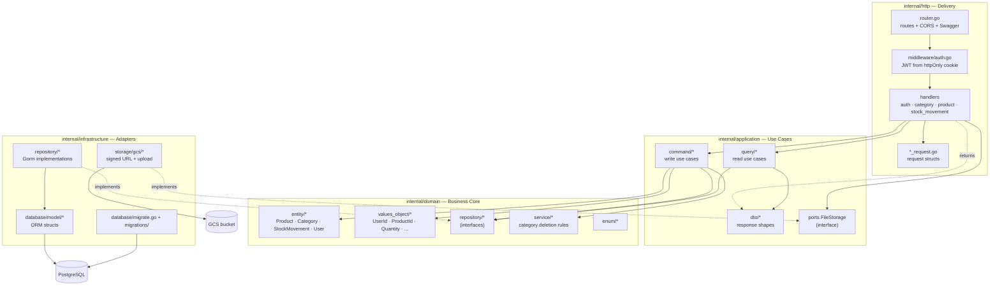
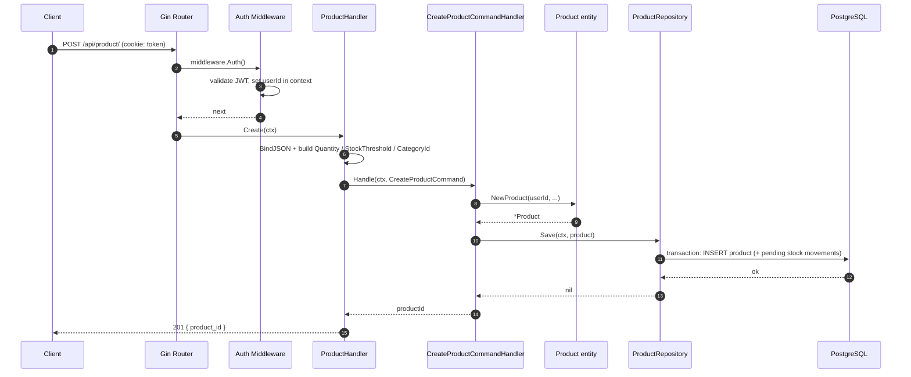
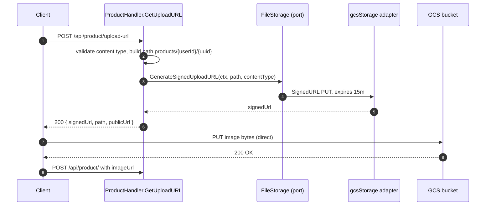

# Stockify — System Architecture

> High-level view in [§1](#1-high-level-architecture); low-level backend view in [§3](#3-low-level-backend-view).

## 1. High-Level Architecture

## 2. Components

| Component | Tech | Responsibility |
|---|---|---|
| Client | Browser | User interface, session cookie |
| Frontend | Next.js 15, React 19, TanStack Query, Vercel | Rendering, data fetching, direct-to-GCS uploads |
| Backend API | Go 1.25, Gin, Gorm, Cloud Run | Auth, business logic, REST API, presigned URL generation |
| Database | PostgreSQL | Users, categories, products, stock movements |
| Object storage | Google Cloud Storage | Product images |

## 3. Low-Level Backend View

### 3.1 Layers & Dependencies

Dependencies point **inward** (Clean / Hexagonal architecture): `http → application → domain`, while `infrastructure` implements interfaces declared by the inner layers.

### 3.2 Write Path — Create Product

`POST /api/product/` (`ProductHandler.Create`).

> `ProductRepository` is the `internal/domain/repository` interface; the Gorm implementation in `internal/infrastructure/repository` is injected at startup.

### 3.3 Image Upload — Signed GCS URL

`POST /api/product/upload-url` (`ProductHandler.GetUploadURL`), then a direct client → GCS upload.

### 3.4 Layer → Folder Map

| Layer | Folder | Depends on | Contains |
|---|---|---|---|
| Delivery | `internal/http` | application, domain, ports | router, JWT middleware, handlers, request structs |
| Application | `internal/application` | domain | command + query handlers, response DTOs, `FileStorage` port |
| Domain | `internal/domain` | — | entities, value objects, repository interfaces, domain services, enums |
| Infrastructure | `internal/infrastructure` | domain, application | Gorm repositories, DB models, migrations, GCS adapter |
| Composition root | `cmd/api/main.go` | all | manual dependency injection / wiring |
